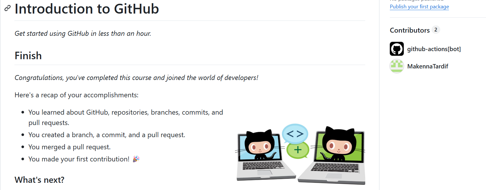
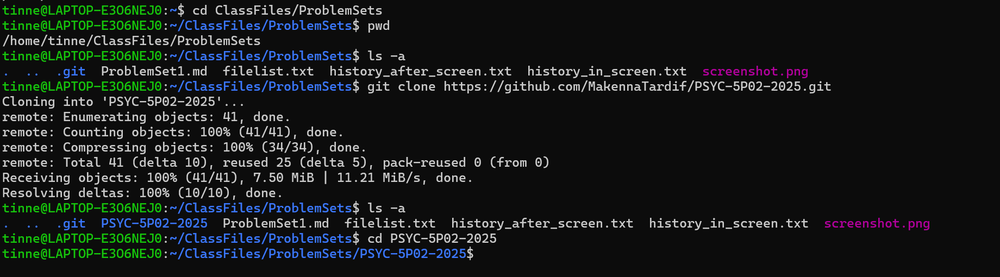

# Problem Set #1: Written Responses
--------------------------------------------
### Question 1a) 
**The command I would use in my terminal if I wanted to list files in my current directory, sorted in reverse order when they were last edited would be:** 
> `ls -rt`

**What does this command do?**
1. `ls` - lists the directory contends
2. `r` - reverses the order of files 
3. `t` - sorts the files also by time

Running this command lists all the files in my current working directory, while also reversing the order of the files and then sorting for the time they were last edited. However, this does not actually list the day and time the files were edited, just lists the file names in reverse chronological order. 

### Question 1b) 
**The command I would use in my terminal if I wanted to also provide the data and time the file was last edited would be:** 
> `ls -lrt`

**What does the addition of the `-l` do?**
The addition of the `-l` lists all files/folders in that directory in long format (i.e., this includes the file number, permissions, owner, group, file size, date/time, etc). More specifically (i.e., to answer this question), it allows me to see the actual date and time the file was last edited.

### Question 1c)
**The first manual description I chose for this question is for the `-t`:**
> This `ls` command is described in the manual as "sort by time, newest first; see --time."

**The second manual description I chose for this question is for the `-l`:**
> This `ls`command is described in the manual as "using a long listing format."

**The third manual description I chose for this question is for the `-r`:**
> This `ls` command is described in the manual as "reverse order while sorting."

### Question 2: Ways to return to your home directory
------------------------------------
**My home directory looks like `/home/tinne`. Three different commands that I can use to navigate to my home directory from `/home/tinne/documents` are:**

 1.  `cd ..`
 2.  `cd /home/tinne`
 3.  `cd ~`

  The first way is by using `cd ..`, which moves me up one level (i.e., my home directory). A second way is by using the absolute path of `cd /home/tinne`, which directly specifies the location of my home directory regardless of my current position. Finally, I can use `cd ~` (or simply cd), which much like `cd /home/tinne`, this brings me directly to my home directory from anywhere.
 
### Question 3: Providing Specific Commands
-------------------------------
**The commands to do the follow (in order) are:**

**1) Making a directory called 'Data'** 
>`mkdir Data`

**2) Creating a file called "subj01.txt'**
> `touch subj01.txt`

**3) Creating four copies of the file above**
> `cp subj02.txt`
`cp subj03.txt`
`cp subj04.txt`
`cp subj05.txt`
`cp subj11.txt`

**4) Move all of the files into the 'Data' directory**
> `mv subj*.txt Data/`

**5) Delete all `.txt` files from the Data directory, except for `subj11.txt`**
>`rm Data/subj0{1..5}.txt`

You could remove each `.txt` file separately (i.e., remove each subject file one-at-a-time), but this command allows you to do all 5 files at once. 

### Question 4: Creating a pipe using the `tee` command
------------------------------
The `tee` command allows me to create a `pipe` where the output is both displayed on the screen and written to a file at the exact same time. Normally, if I were to use the redirect (`>`), the output only goes into the file, and I cannot actually see this happening in my terminal. Thus, this command is particularly useful when I would want to save a copy of the output but still see it immediately in my terminal.

**The command I used to learn about `tee`:**
> `man tee`

**Task I am aiming to perform here:**
The task I am wanting to perform here is to list all the files in my current directory in long format (with details like size, permissions, and date/time modified), but I also want to keep a copy of this listing in a file called `filelist.txt` for later reference (i.e., if I need to see what was in my current working directory at the time this command was run).

**The command I would run in my terminal to do this would be:**
> `ls -l | tee filelist.txt`

**The result of running the above command in my terminal:**
1. In my terminal, I can see the list of files in my directory (i.e., like I would if I had just typed `ls -l`).
2. But at the same, there is a new file called `filelist.txt` is created, which now contains the exact same listing.
3. I can then open the new `filelist.txt` file later with a command such as `vim filelist.txt` to check the saved output.
4. I then opened the new `filelist.txt` file with the command `vim` to see the saved output (i.e., which was `-rw-r--r-- 1 tinne tinne 0 Sep 15 09:45 ProblemSet1.md`- the only thing in my repository at the time I ran the `tee` command with the pipe). 

### Question 5: Using Screen Command
------------------------------
**First, I need to create a new terminal session inside `screen` using:**
> `screen`

**Next, I would like to check my recent commands using:**
> `history` 

**Now, I need to use a pipe (i.e., like I used in the previous question) to write my history to a file using:**
> `history' | tee history_in_screen.txt`

**Next, I need to exit the screen using:**
> `exit`

**Now, I need to save my history again outside the screen using:**
> `history | tee history_after_screen.txt`

**Finally, I need to compare these two files using:**
> `diff history_in_screen.txt history_after_screen.txt`

After running the above command, I can see that these two files are in fact different. First of all, the `.txt` file I created inside the screen only shows the commands run within that particular screen session. However, the `.txt` file I created after I had exited the screens shows my main shell history, which includes both the screen and exit command. Thus, they differ because using the `screen` command actually creates a separate subshell with its own command history.

### Question 6: Introduction to GitHub
-------------------

### Question 7: Forking the Class Repository
------------------

### Question 8: 
------------------
I uploaded all required files to the forked GitHub repository, including my markdown file and the files created in Questions 5–7.  

I also added you (i.e., SMEmrich) as a collaborator under the repository settings.  

**To show the commands I used for committing files, I created a file called `commit_history.txt` using the following command:**  

> `history | grep git | tail -n 10 > commit_history.txt`

Finally, I committed both `commit_history.txt` and my completed markdown file (`ProblemSet1.md`) to my GitHub repository.

